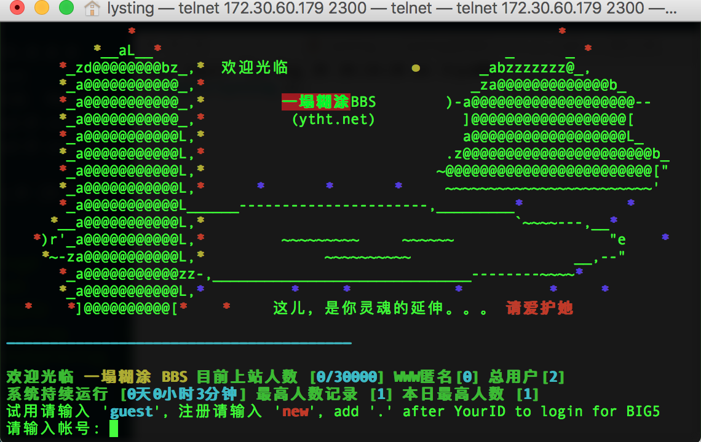

# Ubuntu 安装 YTHT 代码指南

测试环境: Ubuntu 13.10/14.04.1 LTS i686，暂不支持x86-64。

## ssh/telnent　主程序安装

### 新增 bbs用户

```
sudo adduser -d /home/bbs bbs
sudo passwd bbs
```

编辑 `/etc/group`,在 bbs 组最后一行把 bbs 用户添加到 bbs 用户组，如下：

```
bbs:x:1004:bbs
```
1004 是组id，每个人都可能不一样。

### vim 编辑器设置

每次敲入vim很麻烦，做一个简单一点的软链接,输入一个字母e，总比输入三个字母vim轻松。

```
sudo ln -s /usr/bin/vim /usr/bin/e
```
代码文件是 gbk 编码的，vim 默认的编码方式是 UTF-8，打开 gbk 文件会出现乱码，`e ~/.vimrc`，增加:

```
" for chinese character
let &termencoding=&encoding
set fileencodings=utf-8,gbk,ucs-bom,cp936
```
### 安装编译环境
```
sudo apt-get install automake git gcc g++
```
### 安装图形库 gd
```
sudo apt-get install libgd-dev
```
### libghthash
```
mkdir /tmp/libghthash && cd /tmp/libghthash
wget http://www.bth.se/people/ska/sim_home/filer/libghthash-0.6.2.tar.gz
tar zxvf libghthash-0.6.2.tar.gz
cd libghthash-0.6.2/
./configure
make
sudo make install
```
> tips: 运行`nproc`命令查看服务器的CPU个数n，如果 n > 1，make 的时候可以加上核数参数　`make -j n`，加快编译速度。

### 下载安装代码

```
cd ~/
git clone https://github.com/lytsing/ytht.git bbssrc
sudo chown bbs.bbs bbssrc -R
sudo su bbs
cd bbssrc
./makedist.sh
cp site/bbsconfig.sample site/bbsconfig.mybbs
# 修改站名、域名、IP等参数，
e site/bbsconfig.mybbs
./configure --with-site=mybbs
make && make install
```

`./configure` 可能会遇到这些问题：

    checking for forkpty... no
    checking for forkpty in -lutil... no
    configure: error: You don't have forkpty

看情况，是在x86-64装的，目前不支持。


### 启动 BBS

　　用BBS用户运行

```
$BBSHOME/bin/shminit
```
载入共享内存。之后启用BBS守护进程：

$BBSHOME/bin/bbsd
如果你的 BBS 运行在默认的23端口，或其他小于等于1024的端口，可能需要使用root启动，否则这些端口不会开放。也可以临时指定BBS运行于其他端口，如

	$BBSHOME/bin/bbsd 2300

将在 2300 端口启动响应连接请求。此时直接

	telnet localhost

即可连接到本机的23端口，如果一切正常，应当显示“塔、糊、图”的ASCII图案，如下图：



如果未能正常连接，请检查是否用未使用root账户开起1024以下端口、系统是否有防火墙或所在网络禁止连接23端口、本机默认的telnet服务是否尚未禁用。

　　正常连接后，请输入new注册新账号。

　　必须首先被注册的是`SYSOP`账号，所有字母全部大写。此账号注册后自动获得站长权限，并在每次上站时恢复站长权限（如果被更改），所以请务必慎重保管。小写或部分小写的SYSOP账号将不具有站长权限。

　　其次应当注册`guest`，可以选定任意密码， 在第一次登陆后密码将被自动取消。

　　如果不慎将上述账户注册错误，请清空`$BBSHOME/.PASSWDS`，运行

```
killall -9 bbsd
$BBSHOME/bin/shminit
> $BBSHOME/.PASSWDS
```

清除共享内存及已有的用户。注意：如果已有其他用户注册，将同时被删除！关于手动修改.PASSWDS的内容，请参阅后续文章。

　　此后运行重新运行bbsd启动守护进程，连接之并重新注册。


## Web 配置

时过境迁，代码根目录下的`INSTALL.web`安装指南已经不再适用，需要更新到最新的操作系统版本。

### apache + mod_rewrite

#### 安装 fcgi-2.2.2.tar.gz
```
mkdir /tmp/fcgi && cd /tmp/fcgi
wget https://raw.githubusercontent.com/deepurple/bbssrc/master/trunk/software/fcgi-2.2.2.tar.gz
tar zxvf fcgi-2.2.2.tar.gz
cd fcgi-2.2.2/
./configure
make
sudo make install
```
#### 安装 apache
```
sudo apt-get install apache2
sudo a2enmod rewrite
cd /etc/apache2
# 修改成实际的用户和用户组
sudo e envvars
cd /etc/apache2/sites-available
#修改相应的目录和添加 rewrite 规则
sudo e default
sudo /etc/init.d/apache2 restart
```

## 设置 mysql和文章评价

```
apt-get install mysql-server libmysqlclient15-dev
```
创建数据库 bbseva，创建表 articlevote，创建 mysql 用户 bbs，将 password4bbsmysql 换成想要的数据库密码。

```
mysql -u root -p
mysql> create database bbseva;
mysql> use bbseva;
mysql> create table articlevote (
    -> filename char(16) not null,
    -> board char(24) not null,
    -> id char(13) not null,
    -> class int);
mysql> grant select,insert,update,delete on bbseva.* to bbsmysql@localhost identified by "password4bbsmysql";
mysql> \q
```

以 bbs 用户，回到 ytht bbs 的代码目录，编辑 site 目录下的 bbsconfig.sitename 文件，

```
cd ythtsrc
vim site/bbsconfig.sitename
```
修改以下几项内容，

```
LAST_BBS_SQLDB=bbseva
LAST_BBS_SQLUSER=bbsmysql
LAST_BBS_SQLPASSWD=passowrd4bbsmysql
```
然后重新编译安装代码，

```
./configure —with-site=sitename —with-mysql=/usr make update
```
启动 bbsevad，
```
~/bin/bbsevad
```
这时重新登录 bbs 就可以对文章进行评价了。

